# Zwane Financial Services
## Admin Portal — User Guide

**Version 1.0**
**Prepared by AlgoHive for Zwane Financial Services**

---

## Table of Contents

1. [Getting Started](#1-getting-started)
2. [Dashboard](#2-dashboard)
3. [Applications](#3-applications)
4. [Application Detail](#4-application-detail)
5. [Loan Book](#5-loan-book)
6. [Users (Clients & Staff)](#6-users-clients--staff)
7. [Cash Ledger](#7-cash-ledger)
8. [Incoming Payments](#8-incoming-payments)
9. [Outgoing Payments / Disbursements](#9-outgoing-payments--disbursements)
10. [Credit Rules](#10-credit-rules)
11. [SACRRA Bureau Reporting](#11-sacrra-bureau-reporting)
12. [SACRRA Migration Validator](#12-sacrra-migration-validator)
13. [Analytics & Financials](#13-analytics--financials)
14. [Settings](#14-settings)
15. [Common Workflows](#15-common-workflows)
16. [Troubleshooting](#16-troubleshooting)

---

## 1. Getting Started

### 1.1 Logging In

**URL:** `https://zwane-official-three.vercel.app/auth/login.html`

Enter your email address and password. If you have forgotten your password, click "Forgot password" — a reset link will be emailed to you.

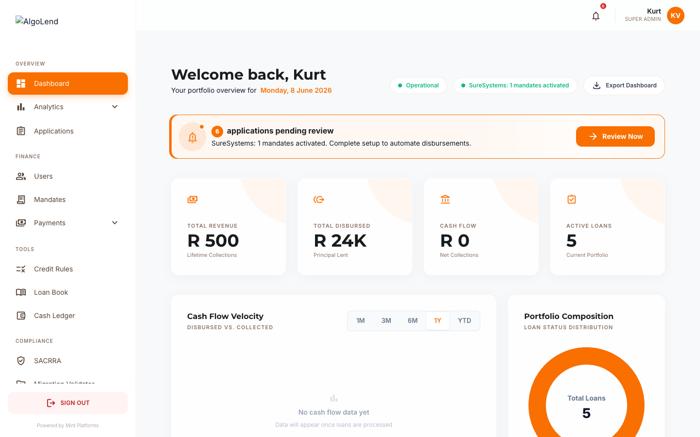

After login, you will land on the **Dashboard**.

### 1.2 User Roles

The admin portal supports several roles:

| Role | What they can do |
|---|---|
| **Super Admin** | Full access — all branches, all settings, all data |
| **Admin / Owner** | Full operational access except billing-level system settings |
| **Branch Admin** | Manage applications, payments and clients **for their assigned branch only** |
| **Branch Staff** | View applications and clients for their branch, capture new applications |
| **Borrower** | Cannot access the admin portal (uses the client app instead) |

Roles are assigned by a Super Admin via the **Users** page → **Staff & Admins** tab.

### 1.3 The Layout

Every admin page has the same layout:

- **Left sidebar** — navigation between modules
- **Top right** — your profile, notifications, sign out
- **Main area** — the page content
- **Logo top-left** — click any time to return to the Dashboard

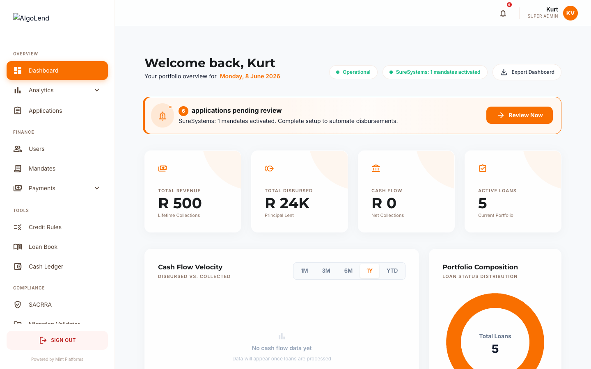

---

## 2. Dashboard

**URL:** `/admin/dashboard`

The Dashboard is the home page — a snapshot of how the business is performing right now.

### 2.1 What you see

**Welcome header** — your name and today's date.

**Action banner** (only appears if there is work to do) — shows pending applications waiting for review. Click "Review Now" to jump straight to the Applications page.

**KPI cards (4 across the top)**

| KPI | What it means |
|---|---|
| **Total Revenue** | Lifetime collections — all repayments received |
| **Total Disbursed** | Principal lent out across all loans |
| **Cash Flow** | Net collections this period |
| **Active Loans** | Number of loans currently being repaid |

**Charts**

- **Cash Flow Velocity** — money out vs money in by month, with 1M / 3M / 6M / 1Y / YTD tabs
- **Portfolio Composition** — donut showing loan status breakdown (Disbursed / In Arrears / In Default / Settled)
- **Vintage Analysis** — recovery rate by cohort (which months had the best repayment performance)
- **Risk Matrix** — bubble chart of credit score vs DTI ratio
- **Conversion Funnel** — application pipeline (Started → Processing → Finalising → Ready)
- **Portfolio Growth** — principal vs interest over time
- **Performance Targets** — radial showing profit margin, portfolio health, recovery rate
- **Revenue Trajectory** — total exposure growth
- **Historical Trends** — long-term performance metrics

### 2.2 Status indicators (header row)

Two pill-shaped indicators show **system health**:

- **Operational / System Error** — backend status
- **SureSystems: Connected** — DebiCheck integration status

### 2.3 Export Dashboard

Click **Export Dashboard** (top right) to download a CSV with all KPI values, pipeline summary, and current portfolio metrics. Useful for board reports.

---

## 3. Applications

**URL:** `/admin/applications`

The Applications page is your **work queue** — every loan application coming through the system.

### 3.1 What you see

**Filter bar at top:**

- **Status tabs** — All / New / Processing / Approved / Disbursed / Rejected / Settled
- **Branch filter** — drop-down to filter by branch
- **Search** — by name, ID, reference number
- **Date range** — From / To
- **+ Create Application** — start a walk-in application

**Application table:**

| Column | Notes |
|---|---|
| Ref | Application reference (e.g. C0001-L0042) |
| Client | Full name + ID number |
| Branch | Where the application was captured |
| Amount | Loan amount requested |
| Status | Coloured badge — see legend below |
| Credit Score | Bureau score with risk band colour |
| Created | When the application started |
| Actions | View / Edit / Approve / Decline |

### 3.2 Status legend

| Status | Meaning |
|---|---|
| 🟡 STARTED | Client just began the application |
| 🔵 BUREAU_CHECKING | Credit check in progress |
| 🔵 BUREAU_OK | Credit check passed |
| 🟠 BUREAU_REFER | Credit check flagged for review |
| 🔵 BANK_LINKING | Bank statement upload in progress |
| 🟢 AFFORD_OK | Affordability passed |
| 🟠 AFFORD_REFER | Affordability flagged |
| 🟣 OFFERED | Loan offer made to client |
| 🟢 OFFER_ACCEPTED | Client accepted the offer |
| 🟣 CONTRACT_SIGN | Contract sent for signing |
| 🟣 DEBICHECK_AUTH | Mandate sent for client authorisation |
| ✅ APPROVED | Ready to disburse |
| 💰 DISBURSED | Money paid out |
| 🔴 IN_ARREARS | Payment overdue |
| 🔴 IN_DEFAULT | More than 30 days overdue |
| ⚫ SETTLED | Loan paid off |
| 🚫 REJECTED | Declined |
| 🚫 CANCELLED | Client withdrew |

### 3.3 Capturing a new walk-in application

Click **+ Create Application**. The wizard has 3 steps:

1. **Client details** — search by ID number to see if they already exist; if not, capture their personal details, address, employer, NOK
2. **Loan details** — amount, term, purpose, frequency
3. **Bank account** — for DebiCheck mandate setup

Submit to land the application in the queue at status `STARTED`.

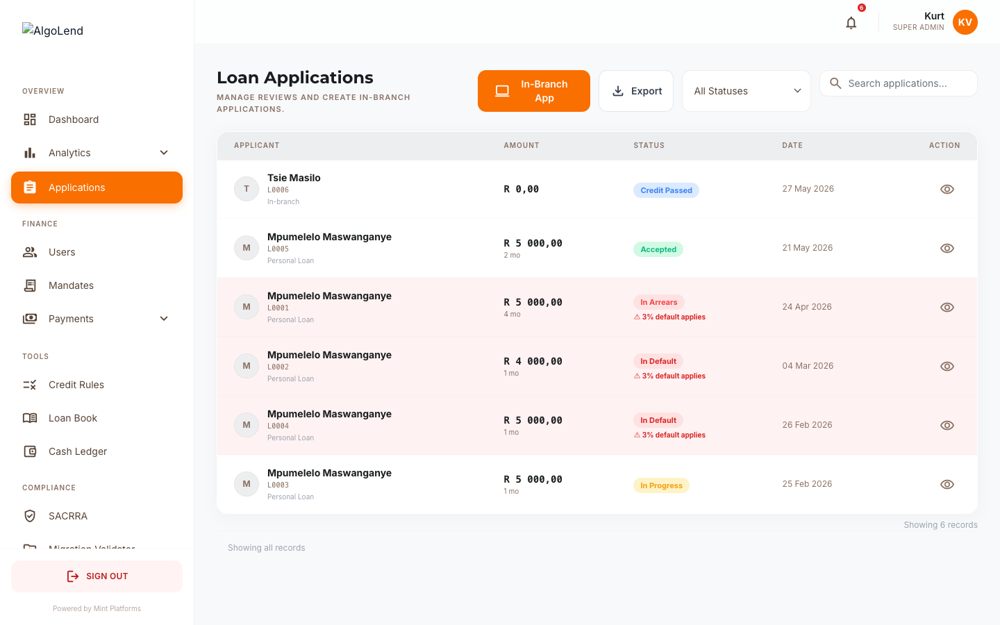

---

## 4. Application Detail

**URL:** `/admin/application-detail?id=<application_id>`

Click any row in Applications to open the **detail page** — the most important page in the system. This is where most work happens.

### 4.1 Left side — client information

Tabs:

- **Personal** — Name, ID, DOB, gender, address. Editable, with a Save button.
- **Next of Kin** — Name, relationship, phone. Editable, with a Save button.
- **Employer** — Employer name, phone, address. Editable, with a Save button.
- **Bank Account** — Bank name, account number, branch code, holder name.
- **Documents** — Uploaded files (ID, bank statement, payslip, till slip). Click to download.

### 4.2 Right side — application data

**Status banner** — Current status and history. Click to see all status changes with timestamps.

**Financial Snapshot:**
- Loan amount, term, monthly instalment, total repayable
- All fees broken out (initiation, service, CPI, VAT, interest)
- Credit Life Insurance (if applicable)

**Affordability:**
- Gross income, expenses, disposable income
- Two income source checkboxes (Salary / Other) — toggle to see what affordability looks like with/without each
- Affordability ratio with traffic-light indicator

**Credit Check:**
- Bureau score with risk band
- Number of accounts, total balance, arrears amount
- Existing judgements, NLR consumer credit data
- **Decline Reasons** (red panel) — if the application was declined, every rule that failed appears here

**Action buttons (right side panel):**

| Button | When to use it |
|---|---|
| **Approve** | Move to APPROVED status — ready to disburse |
| **Decline** | Reject — opens a modal to enter the reason (sent to client) |
| **Send Contract** | Trigger DocuSeal e-contract send |
| **Activate Mandate** | Send DebiCheck mandate to client for authorisation |
| **Mark Disbursed** | Loan disbursed — auto-creates loan record, decrements client balance, posts to ledger |
| **Letters of Demand** | Generate Section 129 NCA legal letter |
| **Route to Head Office** | Escalate to the Online Processing Team for review |
| **View Statement** | Generate branded loan statement (HTML) |

### 4.3 Audit trail

Every status change is logged — who made the change, when, and what changed. Visible in the right sidebar.

---

## 5. Loan Book

**URL:** `/admin/loan-book`

The Loan Book is the live portfolio register — every active and historical loan.

### 5.1 What you see

**Filters:**
- Branch filter
- Status filter — Disbursed / In Arrears / In Default / Settled
- Date range (disbursed from / to)
- Search by client name, reference, or ID

**Summary cards (5 across):**
- **Total Loans** — count
- **Loan Book Value** — sum of outstanding balances
- **In Arrears** — count
- **In Default** — count
- **Avg Days Active** — portfolio age

**Loan table:**

| Column | What it shows |
|---|---|
| Reference | Loan ref number |
| Client | Name + ID |
| Principal | Original amount disbursed |
| **Outstanding** | Live balance — orange if owing, green if zero |
| Monthly | Instalment amount |
| Status | Current status |
| Days Active | How long since disbursement |
| Days Overdue | If in arrears |
| Maturity In | Days until final payment due |
| Disbursed | Disbursement date |
| Maturity Date | Final payment date |
| Band | Credit risk band |
| Purpose | Loan purpose |
| Actions | View / Send SMS reminder (for arrears) |

### 5.2 Sending an SMS reminder

For any loan in `IN_ARREARS` or `IN_DEFAULT` status, a message bubble icon appears in the Actions column. Click it to send a payment reminder SMS to the client.

### 5.3 Exporting

Click **Export** (top right) for a CSV of the filtered loan book — including bank account details for collection purposes.

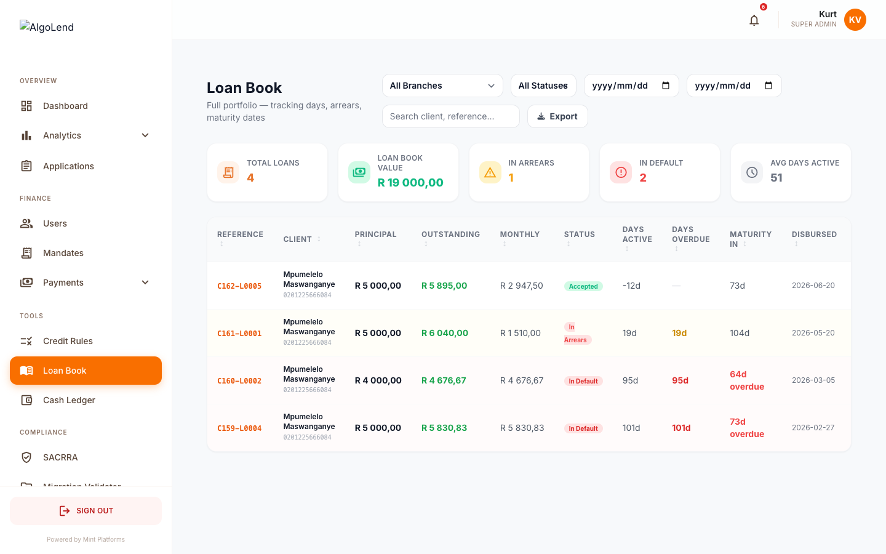

---

## 6. Users (Clients & Staff)

**URL:** `/admin/users`

Manage all users — both clients (borrowers) and staff (admins).

### 6.1 Tabs

- **Clients** — borrowers in the system
- **Staff & Admins** — internal users

### 6.2 Clients tab

**Filters:**
- Branch filter
- Search by name, email, ID

**Columns:**
- Client identity (avatar, name, role)
- Match key (last 8 of UUID)
- Branch
- Compliance — ID Valid / ID Invalid badge
- Action

Click any client to open their **detail panel** — full profile, financial snapshot, all their loan applications, all uploaded documents, transfer between branches.

### 6.3 Staff & Admins tab

Shows internal users with their role and branch assignment.

**+ Invite Staff** (top right) — sends an email invitation to a new staff member with a sign-up link.

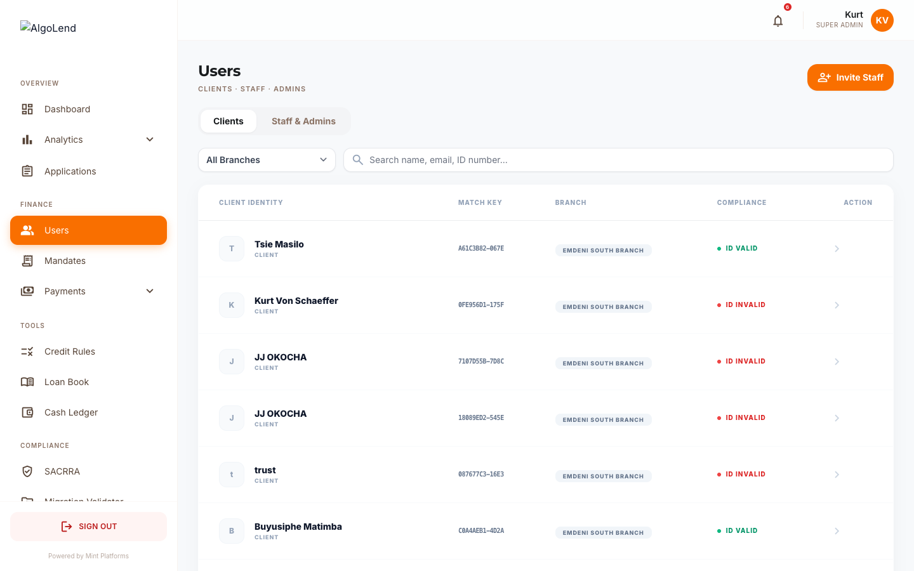

---

## 7. Cash Ledger

**URL:** `/admin/cash-ledger`

The Cash Ledger is the financial journal — every rand that moved in or out, automatic and manual.

### 7.1 What you see

**Filters:**
- Branch filter
- Date range (default: current month)
- Quick buttons: Today / Week / Month / All

**Summary cards (6):**
- Cash In (for the selected period)
- Cash Out (for the selected period)
- Net Position
- Loans Disbursed (cash out by category)
- Repayments Collected (cash in by category)
- Entry count

**Ledger table:**

| Column | Notes |
|---|---|
| Date | Transaction date |
| Type | Cash In / Cash Out / Opening Balance / Closing Balance / Adjustment |
| Category | Loan disbursement / Repayment / Petty Cash / Expense / Bank Deposit / Bank Withdrawal |
| Description | Free text |
| Reference | Loan number or receipt number |
| Cash In | Amount in |
| Cash Out | Amount out |
| Running Balance | Live running total |
| By | Who created the entry |

### 7.2 Automatic entries

The system auto-posts entries for:

- **Disbursements** — when a loan is marked DISBURSED, a `cash_out` entry is auto-created with the loan reference
- **Confirmed payments** — when a manual EFT proof is confirmed, a `cash_in` entry is auto-created

### 7.3 Adding a manual journal entry

Click **+ Add Journal Entry** to open the form. Use this for petty cash, bank deposits, expenses, or any other cash movement.

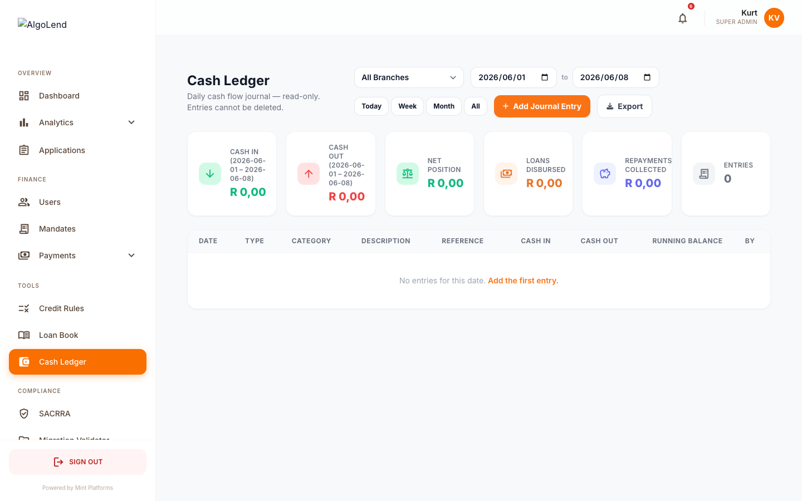

---

## 8. Incoming Payments

**URL:** `/admin/incoming-payments`

This page handles client-side payment submissions and recovery analytics.

### 8.1 Pending Manual Payment Proofs (top panel)

When a client submits proof of an EFT payment via the client portal, it lands here.

Each card shows:
- Client name + phone + loan reference
- Amount paid + payment type (Payment / Settlement)
- Bank reference number
- Proof link (screenshot or URL the client provided)
- How long ago submitted

**Confirm** — Marks payment as confirmed → posts to Cash Ledger → decrements outstanding balance → sends SMS + push + email to client. If it was a Settlement, loan status changes to SETTLED.

**Reject** — Prompts for a reason that gets sent to the client.

### 8.2 Admin Record Payment (with back-date)

Use this when a payment came in via another channel (e.g. cash at branch) and needs to be captured manually. You can backdate the payment.

Fields:
- Application ID / loan reference
- Amount
- Payment type (Partial / Settlement / Arrears)
- Date (default today, editable to backdate)
- Reference

Save → auto-posts to Cash Ledger and decrements loan balance.

### 8.3 Recovery Detail (lower section)

Shows all confirmed payments with:
- KPI cards (MTD Recoveries, Realised Profit, Active Payers)
- Filter tabs (Today / 7 Days / 30 Days / All)
- Searchable table

Click **Sync SureSystems** to pull DebiCheck collection results into the ledger.

**Export CSV** for accounting reconciliation.

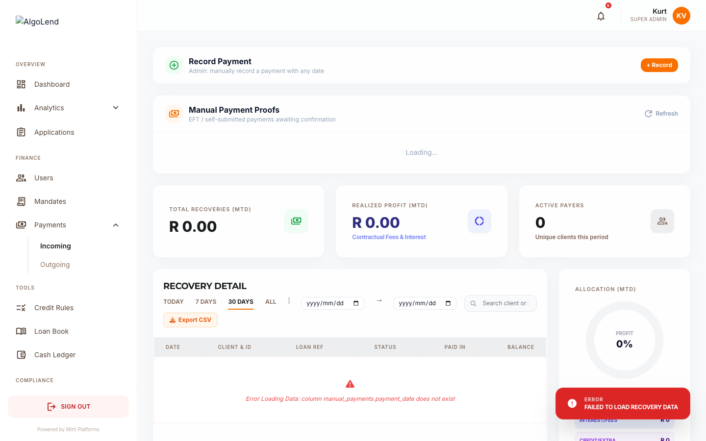

---

## 9. Outgoing Payments / Disbursements

**URL:** `/admin/outgoing-payments`

Manage loan disbursements.

### 9.1 Tabs

- **Pending** — applications ready for disbursement
- **History** — completed disbursements
- **Comparison** — vs expected vs actual

### 9.2 Disbursement workflow

1. Application is approved
2. Appears in **Pending** tab
3. Tick the loans to include in a batch
4. Click **Generate Capitec CSV** — system creates a CSV file ready for upload to bank
5. CSV is PIN-protected (set in env) — enter PIN to download
6. Once bank processes, click **Mark as Disbursed**
7. System:
   - Updates status to DISBURSED
   - Sends client SMS / push / email
   - Posts cash_out entry to Cash Ledger
   - Creates the loan record (sets outstanding balance)

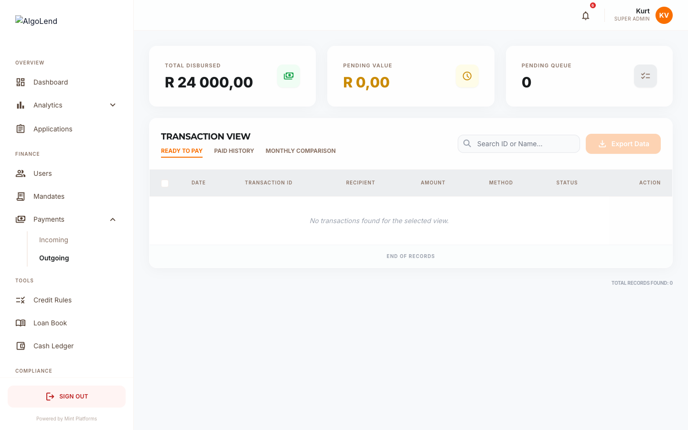

---

## 10. Credit Rules

**URL:** `/admin/credit-rules`

Configure the credit decision engine. This is where you decide who qualifies for what.

### 10.1 Score Bands

The main table is your **score bands** — the bridge from credit bureau score to loan offer.

| Field | Notes |
|---|---|
| Band Label | e.g. "Excellent" |
| Score Range | e.g. 700–850 |
| Risk Level | Low / Medium / High / Declined |
| Max Loan | What this band qualifies for |
| Rate (p.a.) | Interest rate applied |
| Max Term | Maximum repayment term |
| Decision | Approve / Manual Review / Decline |
| 1st Loan Term | Optional restriction for first-time borrowers |
| Decline Message | Shown to client if their band declines |
| Active | Toggle |

Edit any band by clicking the pencil icon. Add new band with **+ Add Band**.

**Overlap warning** — if two bands have overlapping score ranges (e.g. 650–750 and 700–800), a red banner appears. Fix the ranges to prevent unpredictable decisions.

### 10.2 Eligibility Rules

Hard pass/fail criteria checked before bands:

- Minimum credit score
- Minimum income
- Maximum DTI (Debt-to-Income ratio)
- Minimum age
- Must be employed
- No active judgements
- Not under debt review

Toggle on/off, edit thresholds, edit decline messages.

### 10.3 Simulate

Click **Simulate** (top right, purple button) to test a decision before going live. Enter:
- Credit score
- Income
- Monthly debt
- Age
- Employed / Has Judgements / Under Debt Review / First Loan

Click **Run Simulation** to see:
- The exact decision (Approved / Manual Review / Declined)
- Which band matched
- Max loan, rate, term applied
- Every rule that failed with the reason

Use this every time you change a band or rule to make sure it behaves as expected.

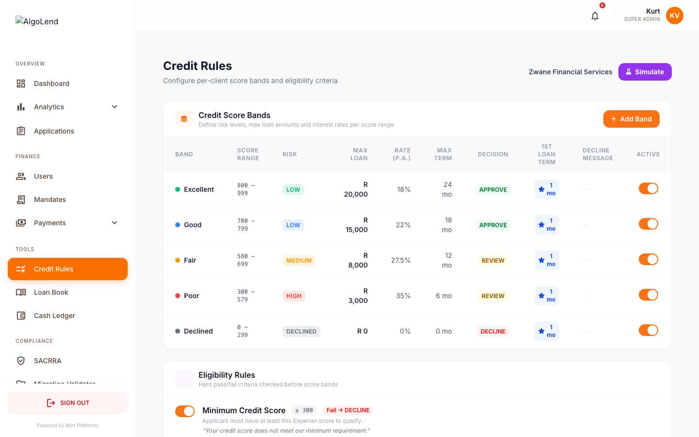

---

## 11. SACRRA Bureau Reporting

**URL:** `/admin/sacrra`

The SACRRA module handles your monthly Layout 700v2 submission to the four credit bureaux (Experian, TransUnion, XDS, Compuscan).

### 11.1 Dashboard tab

Shows:
- Compliance Score ring — % of records currently passing all rules
- Total records ready for submission
- Active issues count
- Bureau acceptance status (Pending / Accepted / Rejected per bureau)

### 11.2 Generating the monthly file

Click **Generate Compliance File** (top right).

A modal appears:
- **Submission Type** — Monthly (default) or Daily
- **Reporting Period** — leave blank for current month, or pick a past month for back-dated submissions
- Click **Generate**

The system:
1. Pulls every loan from the `sacrra_700_view`
2. Builds a 700-character fixed-width text file per Layout 700v2 spec
3. Creates header + data records + trailer
4. Encrypts the file with each bureau's PGP public key
5. Saves the file for download / submission

### 11.3 Submissions tab

History of every SACRRA file generated, with:
- Date generated
- Records included
- Submission status per bureau
- Download links

### 11.4 Bureaux tab

Per-bureau configuration:
- Enabled / Disabled
- Supplier Reference Number (10-char SRN issued by bureau)
- PGP public key
- Submission method (MOVEit auto-upload for Experian, Email for others)
- Submission destination (email address / MOVEit folder)

Configure each bureau once at setup — the system uses these settings for every monthly submission.

### 11.5 Rejections tab

Upload rejection responses from bureaux to see what failed and why. The system parses the error messages and shows which records to fix.

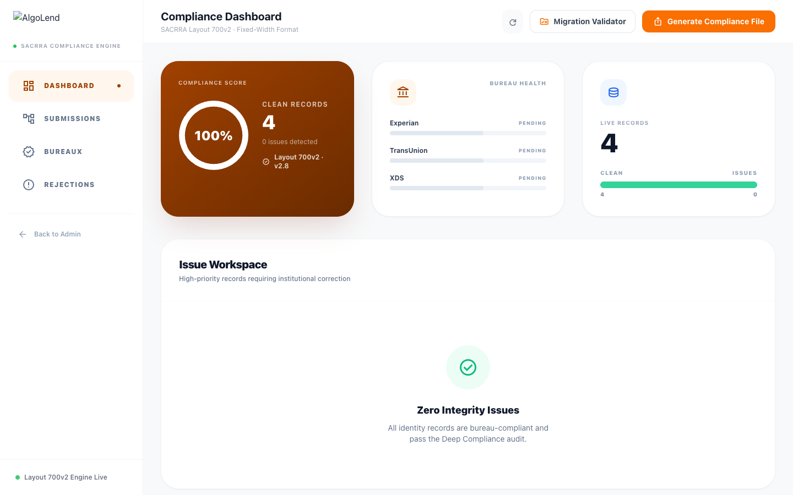

---

## 12. SACRRA Migration Validator

**URL:** `/admin/sacrra-validator`

This is the tool we use to validate an external loan book (e.g. from Zwane's old system) **before** importing it.

### 12.1 Why use this?

When you bring loans across from another lending system, the data needs to pass SACRRA Layout 700v2 rules before it can be reported to bureaux. This tool checks every record up front.

### 12.2 How to use it

**Step 1: Upload Loan Book**

Click the upload area and select a CSV file. The system auto-detects the header row.

**Step 2: Column Mapping**

The system tries to **auto-map** Zwane's column names to our SACRRA fields. Required fields are shown in bold. Adjust any incorrect mappings using the drop-downs.

Required fields:
- SA ID Number
- Surname, First Names
- Address
- Account Number
- Opening Balance, Current Balance
- Date Opened, Term (Months)

Optional fields (recommended):
- DOB, Gender, Mobile, Postal Code
- Status Code, Installment, Months in Arrears

Click **Validate Records**.

**Step 3: Results**

Four cards at the top:
- Total Records
- Valid count (green)
- Errors count (red)
- Compliance % (orange — the headline metric)

Tab filter: All / Failed Only / Passed Only

Table shows every record with:
- Row number
- SA ID
- Name
- Balance
- Status
- Issues (red list of every failed rule per record)

**Step 4: Download**

- **Errors CSV** — send back to Zwane to fix
- **Valid CSV** — cleaned, column-normalised, ready for import

### 12.3 What gets checked

- SA ID must be 13 digits with valid Luhn checksum
- DOB must match SA ID digits 1–6
- Gender must match SA ID digit 11 (0–4 = Female, 5–9 = Male)
- All required fields populated
- Balances ≥ 0, within N9 limit (max R999,999,999)
- Dates valid YYYYMMDD, opened date in past
- Status codes valid (C/P/D/T/V/L)
- Months in arrears consistent with status (e.g. status C cannot have arrears)
- Mobile in valid SA format
- Postal code 4 digits

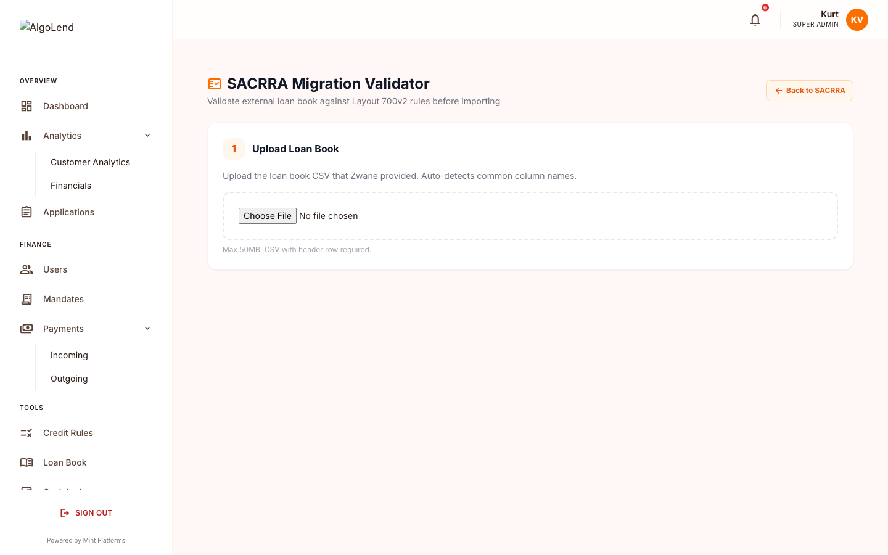

---

## 13. Analytics & Financials

### 13.1 Analytics

**URL:** `/admin/analytics`

Deep-dive analytics — cohort analysis, risk metrics, vintage performance, recovery curves. Includes CSV export.

### 13.2 Financials

**URL:** `/admin/financials`

The financial reporting module — income statement, balance sheet, cash flow. Date-range filters with YTD default. Export to CSV for board reports.

---

## 14. Settings

**URL:** `/admin/settings`

System configuration. Most of the time you only touch this at initial setup.

### 14.1 Tabs

- **My Profile** — Your own profile, password, avatar
- **Security** — Push notification settings, change password
- **User Management** — Add / edit / remove staff
- **Billing** — Subscription and invoice info
- **System Branding** — Company-wide settings (Super Admin only)

### 14.2 System Branding tab

Critical sections:

**Company Identity**
- Company name (appears everywhere)
- Company logo (upload or paste URL)

**Company Legal Details** (appear in contracts and NCA disclosures)
- NCR Registration Number
- Company Registration Number
- VAT Number
- Branch Code (for contracts)
- Company phone
- Physical address
- Postal address

**Company Banking Details** (used by clients for manual EFT payments)
- Bank name
- Account holder name
- Account number
- Branch code
- Account type
- Reference prefix (clients use this + their loan ID)
- **Live preview** at the bottom showing exactly what clients see

**Theme Colours**
- Primary / Secondary / Tertiary
- Live gradient preview

**Login Styling**
- Background wallpaper
- Overlay colour
- Auth page carousel slides

Click **Save Changes** to commit.

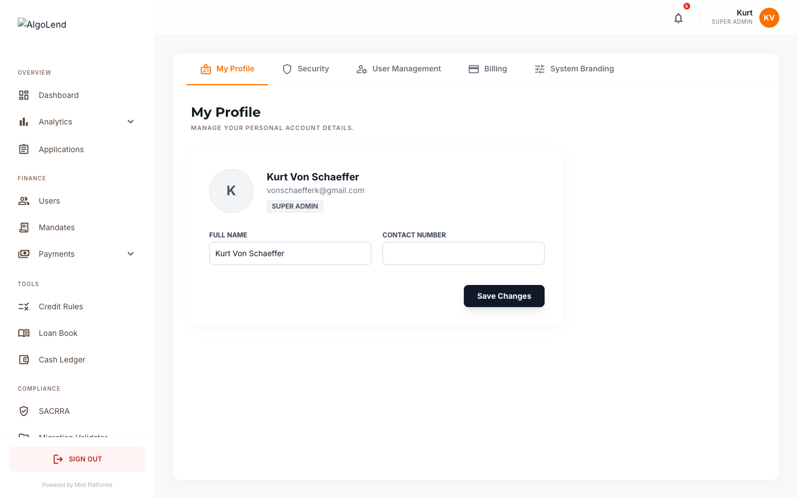

---

## 15. Common Workflows

### 15.1 Approve and disburse a new loan

1. **Applications** → click application → opens **Application Detail**
2. Review **Credit Check** section — score, decline reasons (if any)
3. Review **Affordability** — toggle income sources if needed
4. Click **Approve**
5. Click **Send Contract** — client signs via DocuSeal
6. Once signed, click **Activate Mandate** — client authorises DebiCheck via SureSystems
7. Once authorised, status becomes APPROVED
8. Go to **Outgoing Payments** → Pending tab → tick the loan → **Generate Capitec CSV** → upload to bank
9. Once bank confirms paid, click **Mark as Disbursed**
10. Client gets SMS / push / email — loan balance is now tracked

### 15.2 Confirm a manual EFT payment

1. Client submits proof of payment via client app
2. Goes to **Incoming Payments** → Pending Manual Payment Proofs panel
3. Open the card, check the proof (screenshot link or reference number)
4. Verify amount matches your bank statement
5. Click **Confirm**
6. Automatically: posts to Cash Ledger, decrements loan balance, sends client SMS / push / email

### 15.3 Record a payment that came in via cash or other channel

1. **Incoming Payments** → Admin Record Payment panel
2. Pick application
3. Enter amount and reference
4. Backdate if needed
5. Save → auto-posts to Cash Ledger and decrements balance

### 15.4 Send arrears reminders

1. **Loan Book** → Status filter = In Arrears
2. For each row, click the SMS icon in Actions column
3. Client receives reminder

### 15.5 Generate and submit monthly SACRRA file

1. End of month
2. Go to **SACRRA** → **Generate Compliance File**
3. Confirm settings (Monthly type, current period)
4. Click Generate
5. File is built, encrypted per bureau, ready to submit
6. For Experian — auto-uploaded via MOVEit
7. For TransUnion / XDS / Compuscan — download `.pgp` file and email per bureau settings

### 15.6 Validate Zwane's loan book before import

1. **SACRRA Migration Validator** → upload Zwane's CSV
2. Adjust column mappings if needed
3. Click Validate Records
4. Download **Errors CSV** → send to Zwane for fixes
5. When file passes, download **Valid CSV** → use for database import

### 15.7 Add or update a staff member

1. **Users** → Staff & Admins tab
2. Click **+ Invite Staff** to invite a new user — they get an email with sign-up link
3. To change an existing user's role or branch, click their row → edit modal opens

### 15.8 Change credit policy

1. **Credit Rules**
2. Edit existing band or rule, or add new one
3. Click **Simulate** to test a few example clients
4. Confirm the decisions are correct before saving

### 15.9 Route a complex case to Head Office

1. Open the **Application Detail** for the loan in question
2. Click **Route to Head Office** in the action panel
3. Application now appears in Head Office's queue with a routed marker
4. Original branch can still see the application but cannot action it until Head Office reviews

---

## 16. Troubleshooting

### Login fails
- Check email and password
- Use "Forgot password" to reset
- Confirm you have an active account — ask the Super Admin

### Pages slow to load
- Refresh the page
- Check internet connection
- Try again in a few minutes

### Can't see a client / application
- Check your branch filter — you might only have access to your branch's data
- Check the status filter — old or archived items may be hidden

### Client can't see banking details on the EFT screen
- **Settings** → **System Branding** → **Company Banking Details** — ensure all fields are filled in

### SMS notifications not sending
- Check **System Status** indicator on Dashboard
- Contact your platform administrator

### A disbursement marked as paid but no client SMS
- Check the client's `cell_tel_no` field on their profile — must be valid SA format
- Check SMS provider quota with platform administrator

### Cash Ledger doesn't reflect a payment
- Confirm the payment was set to "Confirmed" — pending entries don't update balances
- Check the date filter on the Cash Ledger

### SACRRA file generated but no records
- Check the `sacrra_700_view` — only loans with eligible statuses appear
- Check date filter on the SACRRA page

### Credit score not updating
- Check **Settings** that EXPERIAN_USERNAME and EXPERIAN_PASSWORD are set
- Confirm the client's ID number is correct
- View the credit check error log on the application detail page

---

## Contact

For platform support or feature requests, contact:

**AlgoHive (Pty) Ltd**
Email: info@algolend.co.za
Phone: 069 119 5046

---

*End of guide — Version 1.0 — Prepared by AlgoHive for Zwane Financial Services*
